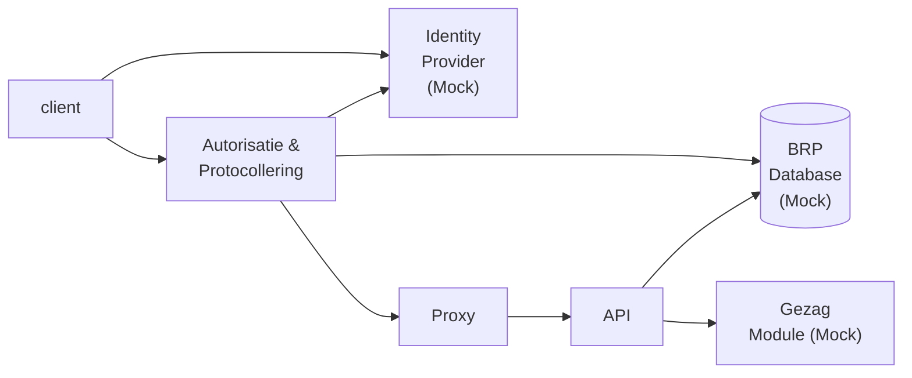

# BRP shared

## Autorisatie en Protocollering

De Autorisatie en Protocollering applicatie is een microservice die
- bepaalt of een afnemer is geautoriseerd om personen in de BRP te zoeken en de gevraagde gegevens mag raadplegen
- vastlegt welke vraag de afnemer heeft gesteld en van welke personen gegevens aan de afnemer is geleverd

Voordat het autoriseren wordt gedaan, wordt door de Autorisatie en Protocollering microservice gevalideerd 
- dat de afnemer is geauthenticeerd door een vertrouwde Identity Provider
- dat de input in de request valide is

## Identity Provider Mock

De Autorisatie en Protocollering microservice valideert de identiteit van de afnemer door de access token die de afnemer met elke request meestuurt door een vertrouwde Identity Provider is gemaakt.
Om de werking van deze validatie zo vroeg mogelijk in het development proces te kunnen valideren, is de Identity Provider Mock geïmplementeerd die zoveel mogelijk de Identity Provider in productie simuleert.

Omdat de Identity Provider Mock ook een volwaardige Identity Provider is, kan deze ook worden gebruikt in test scenarios om de autorisatie regels voor verschillende afnemer types te beschrijven en geautomatiseerd te valideren.

