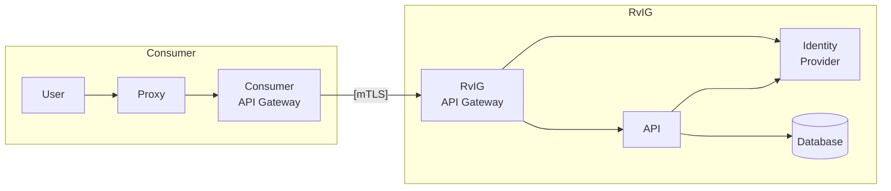

## Huidige situatie



## Nieuwe situatie met Kubernetes

De proxy wordt gehost binnen RvIG. Proxy, API en de (nog te ontwikkelen) Autorisatie & Protocollering container applicatie worden gedeployed als een multi-container pod.

```mermaid
flowchart LR

User
Proxy
CAGW["Consumer
API Gateway"]
PAGW["RvIG
API Gateway"]
API
IDP["Identity
Provider"]
AP["Autorisatie &
Protocollering"]
DB[(Database)]

subgraph Consumer
    direction LR
    User ----> CAGW
end

CAGW ----> PAGW

subgraph P[RvIG]
    direction LR
    PAGW --> IDP
    PAGW --> AP
    subgraph Multicontainer Pod
        AP --> Proxy
        Proxy --> API
    end
    AP ----> IDP
    API -- R --> DB
    AP -- ["R autorisatie &
W protocollering"] --> DB
end
```

Voordelen:
- Netwerk configuratie kan hetzelfde blijven
- Toegangsbeveiliging beveiliging kan hetzelfde blijven. Hoewel er meer containers zijn hoeven er geen extra poorten te worden geconfigureerd voor de communicatie tussen de verschillende containers omdat ze in één pod zitten. Communicatie met de containers kan alleen via één externe poort en alleen met de container die is gemapt naar de externe poort
- Autorisatie en met name validatie van de access token bij de IDP hoeft alleen door de autorisatie & protocollering container applicatie te worden uitgevoerd. Er is geen extra vertraging door extra access token validatie aanroepen